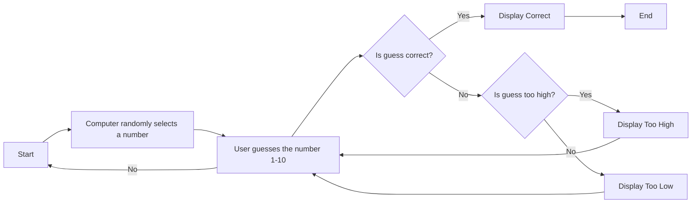

This is the flowchart for my number guessing game

```mermaid
graph LR;
  A[Start] --> B[Computer randomly selects a number];
  B --> C[User guesses the number 1-10];
  C --> |No| A
  C --> D{Is guess correct?};
  D --> |Yes| E[Display Correct];
  E --> F[End];
  D --> |No| G{Is guess too high?};
  G -->|Yes| H[Display Too High];
  G -->|No| I[Display Too Low];
  H --> C;
  I-->C;
```
